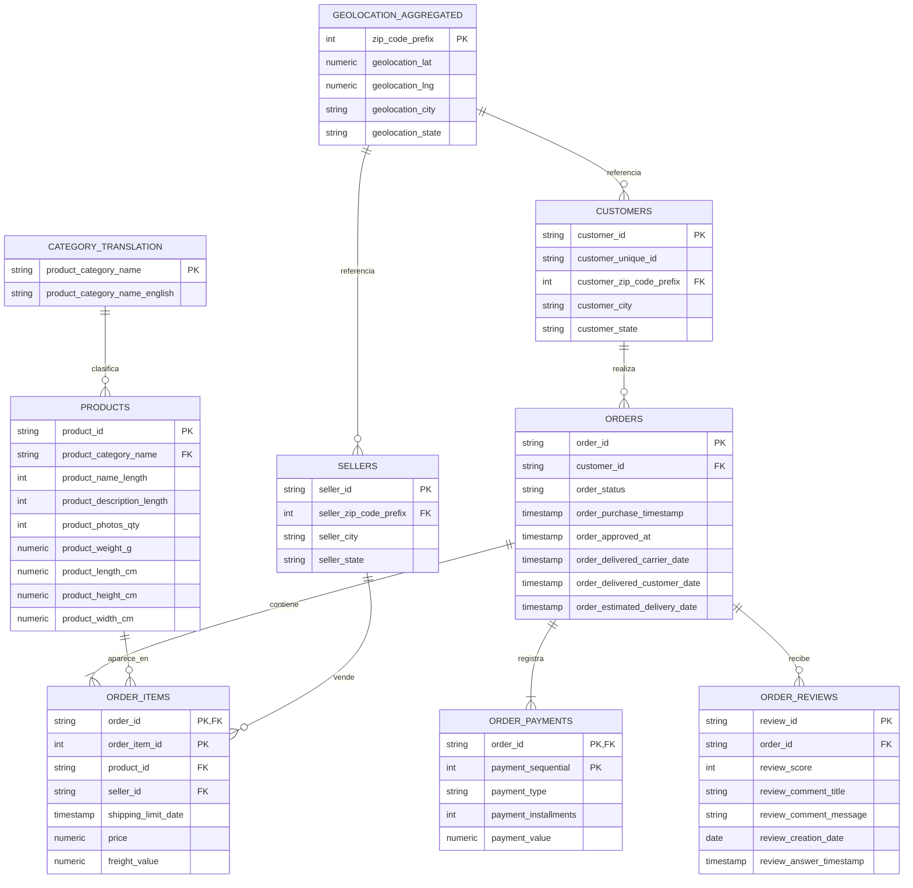

  ## Análisis de Formas Normales y Aplicación Práctica al Dataset Completo

  ### Punto de partida: tabla denormalizada OrdersFull

  Para estudiar la normalización del dominio completo, se parte de una tabla conceptual denormalizada llamada **OrdersFull**, obtenida al combinar órdenes, clientes, items, productos, vendedores, pagos, reseñas, categorías y componentes geográficos en una sola estructura lógica.

  Una representación simplificada de OrdersFull sería:

  | Grupo | Columnas representativas |
  |---|---|
  | Orden | order_id, order_status, order_purchase_timestamp, order_approved_at, order_estimated_delivery_date |
  | Cliente | customer_id, customer_unique_id, customer_zip_code_prefix, customer_city, customer_state |
  | Item | order_item_id, product_id, seller_id, shipping_limit_date, price, freight_value |
  | Producto | product_category_name, product_name_lenght, product_description_lenght, product_photos_qty, product_weight_g, product_length_cm, product_height_cm, product_width_cm |
  | Categoría | product_category_name_english |
  | Pago | payment_sequential, payment_type, payment_installments, payment_value |
  | Reseña | review_id, review_score, review_comment_title, review_comment_message, review_creation_date, review_answer_timestamp |
  | Vendedor | seller_zip_code_prefix, seller_city, seller_state |
  | Geografía | geolocation_zip_code_prefix, geolocation_lat, geolocation_lng, geolocation_city, geolocation_state |

  Esta tabla es útil para analítica exploratoria, pero es una mala base transaccional porque mezcla entidades con granularidades distintas:

  - Una orden puede tener muchos items.
  - Una orden puede tener múltiples pagos.
  - Una orden puede tener reseñas repetidas en casos específicos del dataset.
  - Un producto puede aparecer en miles de órdenes.
  - Un vendedor atiende múltiples productos y múltiples órdenes.
  - Un código postal puede aparecer con múltiples coordenadas en geolocation.

  ### 1FN: Primera Forma Normal

  **Regla:** todos los atributos deben ser atómicos y no deben existir grupos repetitivos ni listas multivaluadas en una misma fila.

  #### Violaciones de 1FN en OrdersFull

  En la tabla denormalizada aparecen grupos repetitivos naturales:

  - `items[]` dentro de una orden.
  - `payments[]` dentro de una orden.
  - `reviews[]` asociadas a una orden.
  - Posibles repeticiones de localización por código postal.

  Ejemplo conceptual de violación:

  | order_id | customer_id | items | payments |
  |---|---|---|---|
  | O1 | C1 | [(P1, S1, 100), (P2, S2, 80)] | [(credit_card, 150), (voucher, 30)] |

  Eso viola 1FN porque `items` y `payments` son conjuntos repetitivos dentro de una sola fila.

  #### Aplicación práctica de 1FN

  Para cumplir 1FN se separan los grupos repetitivos en filas individuales:

  - Una fila por item de orden.
  - Una fila por pago de orden.
  - Una fila por reseña.
  - Una fila por producto.
  - Una fila por vendedor.

  Resultado práctico en el dataset:

  - `orders` conserva una fila por orden.
  - `order_items` conserva una fila por item de orden.
  - `order_payments` conserva una fila por evento de pago.
  - `order_reviews` conserva una fila por reseña.

  ### 2FN: Segunda Forma Normal

  **Regla:** la tabla debe estar en 1FN y todo atributo no clave debe depender de la clave completa, no de una parte de una clave compuesta.

  #### Violaciones de 2FN en OrdersFull

  Si OrdersFull se modela con una clave compuesta de nivel detalle, por ejemplo:

  `(order_id, order_item_id, payment_sequential, review_id)`

  aparecen dependencias parciales evidentes:

  - `order_status`, `order_purchase_timestamp` dependen solo de `order_id`.
  - `customer_id`, `customer_city`, `customer_state` dependen solo de `order_id` o de `customer_id`.
  - `product_id`, `product_weight_g`, `product_category_name` dependen solo del item o directamente de `product_id`.
  - `seller_id`, `seller_city`, `seller_state` dependen solo de `seller_id`.
  - `payment_type`, `payment_value` dependen solo de `(order_id, payment_sequential)`.
  - `review_score` y comentarios dependen solo de `review_id` o de la reseña asociada.

  #### Aplicación práctica de 2FN

  Para eliminar dependencias parciales se descompone OrdersFull en entidades con una única granularidad:

  - `orders(order_id, customer_id, order_status, timestamps...)`
  - `order_items(order_id, order_item_id, product_id, seller_id, shipping_limit_date, price, freight_value)`
  - `order_payments(order_id, payment_sequential, payment_type, payment_installments, payment_value)`
  - `order_reviews(review_id, order_id, review_score, ...)`
  - `products(product_id, product_category_name, dimensiones...)`
  - `customers(customer_id, customer_unique_id, ubicación...)`
  - `sellers(seller_id, ubicación...)`

  Con esto, cada atributo depende de la clave completa de su tabla.

  ### 3FN: Tercera Forma Normal

  **Regla:** la tabla debe estar en 2FN y no debe haber dependencias transitivas entre atributos no clave.

  #### Violaciones de 3FN en OrdersFull y en una descomposición incompleta

  Las dependencias transitivas más relevantes del dominio son:

  - `order_id -> customer_id -> customer_unique_id, customer_city, customer_state`
  - `product_id -> product_category_name -> product_category_name_english`
  - `seller_id -> seller_zip_code_prefix, seller_city, seller_state`
  - `customer_zip_code_prefix -> geolocation_city, geolocation_state, geolocation_lat, geolocation_lng` (con la salvedad de que en el dataset geolocation no es estrictamente funcional por duplicados y múltiples coordenadas por prefijo)

  Esto significa que si una tabla de órdenes almacenara atributos del cliente, de la categoría o del vendedor, introduciría redundancia y riesgo de anomalías de actualización.

  #### Aplicación práctica de 3FN

  La solución es separar entidades y catálogos de referencia:

  - `customers` aislada de `orders`
  - `products` aislada de `order_items`
  - `category_translation` separada de `products`
  - `sellers` aislada de `order_items`
  - `geolocation` tratada como dimensión o tabla auxiliar, no como dependencia funcional estricta de una sola fila por zip

  #### Tablas del proyecto que deben mantenerse en 3FN

  Para el núcleo transaccional del proyecto conviene mantener en 3FN:

  - `customers`
  - `orders`
  - `order_items`
  - `order_payments`
  - `order_reviews`
  - `products`
  - `sellers`
  - `category_translation`

  ### 4FN: Cuarta Forma Normal

  **Regla:** la tabla debe estar en 3FN/BCNF y no debe contener dependencias multivaluadas independientes.

  #### Violaciones de 4FN en OrdersFull

  En una sola fila de OrdersFull conviven múltiples conjuntos independientes por orden:

  - conjunto de items
  - conjunto de pagos
  - conjunto de reseñas

  Si se mezclan en una única relación, aparece explosión combinatoria. Por ejemplo, una orden con 3 items y 2 pagos genera 6 combinaciones artificiales, aunque pagos e items no dependan entre sí.

  #### Aplicación práctica de 4FN

  La separación en:

  - `order_items`
  - `order_payments`
  - `order_reviews`

  evita dependencias multivaluadas y elimina duplicidad artificial en el modelo relacional.

  ### 5FN: Quinta Forma Normal

  **Regla:** la tabla no debe poder descomponerse más en relaciones menores sin perder información o introducir tuplas espurias al recomponerla.

  #### Riesgo de violación de 5FN en OrdersFull

  OrdersFull intenta representar simultáneamente relaciones entre:

  - orden y cliente
  - orden e item
  - item y producto
  - item y vendedor
  - orden y pago
  - orden y reseña

  Si se fuerza una sola tabla para todos esos vínculos, los joins reconstruyen combinaciones inválidas entre hechos independientes. El caso más claro es la mezcla entre items y pagos.

  #### Aplicación práctica de 5FN

  El esquema final separa relaciones genuinas:

  - `orders` relaciona una orden con un cliente.
  - `order_items` relaciona una orden con productos y vendedores.
  - `order_payments` relaciona una orden con pagos.
  - `order_reviews` relaciona una orden con reseñas.

  Con ello, cada join recompone únicamente hechos válidos del negocio.

  ### Esquema normalizado final propuesto

  #### Claves primarias y foráneas propuestas

  | Tabla | PK propuesta | FK propuestas |
  |---|---|---|
  | customers | customer_id | customer_zip_code_prefix -> geolocation_aggregated.zip_code_prefix |
  | orders | order_id | customer_id -> customers.customer_id |
  | order_items | (order_id, order_item_id) | order_id -> orders.order_id, product_id -> products.product_id, seller_id -> sellers.seller_id |
  | order_payments | (order_id, payment_sequential) | order_id -> orders.order_id |
  | order_reviews | review_id | order_id -> orders.order_id |
  | products | product_id | product_category_name -> category_translation.product_category_name |
  | sellers | seller_id | seller_zip_code_prefix -> geolocation_aggregated.zip_code_prefix |
  | category_translation | product_category_name | Ninguna |
  | geolocation_aggregated | zip_code_prefix | Ninguna |

  #### Nota sobre geolocation

  La tabla original `geolocation` no es una dimensión limpia de código postal, porque un mismo `geolocation_zip_code_prefix` aparece repetido con múltiples latitudes y longitudes. Para diseño operacional conviene construir una vista o tabla derivada, por ejemplo `geolocation_aggregated`, con una sola fila por prefijo postal usando reglas de negocio como promedio de coordenadas o selección de la moda por ciudad/estado.

  ### Diagrama del esquema normalizado final



  ## Trade-offs de Normalización y Desnormalización Estratégica

  ### Ventajas de una alta normalización

  - Reduce redundancia de datos.
  - Disminuye anomalías de inserción, actualización y borrado.
  - Mejora la integridad referencial del núcleo transaccional.
  - Facilita auditoría y consistencia en procesos ACID.
  - Hace más claro el gobierno del dato por entidad de negocio.

  ### Desventajas de una alta normalización

  - Incrementa la cantidad de joins en consultas analíticas y operativas.
  - Puede degradar tiempos de respuesta en lecturas complejas de catálogos o dashboards.
  - Hace más costosa la construcción de vistas de negocio completas.
  - Complica la explotación en casos de uso orientados a documento o lectura intensiva.

  ### Casos de uso para desnormalización estratégica

  Conviene desnormalizar de forma controlada en los siguientes escenarios:

  - **Catálogo de productos para front-end**: producto + nombre de categoría en inglés + métricas derivadas.
  - **Vista de orden enriquecida**: orden + items + pagos + reseña para consulta rápida de detalle de pedido.
  - **Analítica geográfica**: tabla agregada por estado/ciudad con ventas, ticket promedio y tiempos de entrega.
  - **Reporting comercial**: fact tables o materialized views con medidas de ventas, flete, score y cancelación.

  ### Respuesta para el proyecto

  #### ¿Qué tablas normalizar hasta 3FN?

  Mantener en 3FN dentro de PostgreSQL:

  - `customers`
  - `orders`
  - `order_items`
  - `order_payments`
  - `order_reviews`
  - `products`
  - `sellers`
  - `category_translation`
  - una versión depurada de `geolocation` para referencia territorial

  #### ¿Dónde considerar desnormalización?

  Considerar desnormalización estratégica en MongoDB o en vistas materializadas:

  - `order_detail_document`: orden con items, pagos resumidos y reseña más reciente.
  - `product_catalog_document`: producto con categoría traducida, métricas de venta y score agregado.
  - `seller_performance_view`: vendedor con métricas agregadas de fulfillment y revenue.
  - `customer_360_view`: cliente con historial resumido de compras y segmentación.

  ## Estudio de Modelado Conceptual, Lógico y Físico

  ### 1. Fase conceptual

  #### Entidades del dominio

  Las entidades principales del dominio Ecommify/Olist son:

  - **Customer**: comprador de la plataforma.
  - **Order**: evento transaccional principal.
  - **OrderItem**: línea de detalle de una orden.
  - **Product**: artículo ofrecido en la plataforma.
  - **Seller**: proveedor o vendedor del producto.
  - **Payment**: registro de pago asociado a una orden.
  - **Review**: reseña emitida tras la compra.
  - **Category**: clasificación de productos.
  - **Geolocation**: referencia territorial para clientes y vendedores.

  #### Atributos por entidad

  | Entidad | Atributos principales |
  |---|---|
  | Customer | customer_id, customer_unique_id, zip_code_prefix, city, state |
  | Order | order_id, status, purchase_timestamp, approved_at, delivered_carrier_date, delivered_customer_date, estimated_delivery_date |
  | OrderItem | order_item_id, shipping_limit_date, price, freight_value |
  | Product | product_id, category_name, weight, length, height, width, photos_qty |
  | Seller | seller_id, zip_code_prefix, city, state |
  | Payment | payment_sequential, payment_type, payment_installments, payment_value |
  | Review | review_id, review_score, comment_title, comment_message, review_creation_date, review_answer_timestamp |
  | Category | product_category_name, product_category_name_english |
  | Geolocation | zip_code_prefix, lat, lng, city, state |

  #### Relaciones y cardinalidades

  - Un Customer realiza muchas Orders: `Customer 1:N Order`.
  - Una Order contiene muchos OrderItems: `Order 1:N OrderItem`.
  - Un Product aparece en muchos OrderItems: `Product 1:N OrderItem`.
  - Un Seller vende muchos OrderItems: `Seller 1:N OrderItem`.
  - Una Order tiene muchos Payments: `Order 1:N Payment`.
  - Una Order puede tener una o varias Reviews registradas en el dataset: `Order 1:N Review`.
  - Una Category clasifica muchos Products: `Category 1:N Product`.
  - Un Geolocation agregado puede asociarse a muchos Customers y Sellers: `Geolocation 1:N Customer` y `Geolocation 1:N Seller`.

  #### Diagrama ER conceptual

  ```mermaid
    erDiagram
        CUSTOMER {
            string customer_id
            string customer_unique_id
            string city
            string state
        }

        ORDER {
            string order_id
            string status
            datetime purchase_timestamp
            datetime estimated_delivery_date
        }

        ORDER_ITEM {
            int order_item_id
            decimal price
            decimal freight_value
            datetime shipping_limit_date
        }

        PAYMENT {
            int payment_sequential
            string payment_type
            int payment_installments
            decimal payment_value
        }

        REVIEW {
            string review_id
            int review_score
            string review_comment_title
            string review_comment_message
        }

        PRODUCT {
            string product_id
            string category_name
            decimal product_weight_g
            int product_photos_qty
        }

        CATEGORY {
            string product_category_name
            string product_category_name_english
        }

        SELLER {
            string seller_id
            string city
            string state
        }

        GEOLOCATION {
            int zip_code_prefix
            string city
            string state
            decimal lat
            decimal lng
        }

        CUSTOMER ||--o{ ORDER : realiza
        ORDER ||--|{ ORDER_ITEM : contiene
        ORDER ||--|{ PAYMENT : registra
        ORDER ||--o{ REVIEW : recibe
        PRODUCT ||--o{ ORDER_ITEM : aparece_en
        SELLER ||--o{ ORDER_ITEM : abastece
        CATEGORY ||--o{ PRODUCT : clasifica
        GEOLOCATION ||--o{ CUSTOMER : ubica
        GEOLOCATION ||--o{ SELLER : ubica
  ```

  ### 2. Fase lógica

  La fase lógica transforma el modelo ER en un esquema relacional aplicando reglas estándar:

  - entidad -> tabla
  - relación 1:N -> FK en el lado N
  - relación N:M -> tabla intermedia

  En este dominio, la relación entre órdenes, productos y vendedores queda resuelta mediante `order_items`, que funciona como tabla intermedia y además almacena atributos propios del hecho comercial.

  #### Esquema relacional lógico propuesto

  | Tabla | Columnas clave |
  |---|---|
  | customers | customer_id PK, customer_unique_id UK, customer_zip_code_prefix FK |
  | orders | order_id PK, customer_id FK |
  | order_items | (order_id, order_item_id) PK, product_id FK, seller_id FK |
  | order_payments | (order_id, payment_sequential) PK |
  | order_reviews | review_id PK, order_id FK |
  | products | product_id PK, product_category_name FK |
  | sellers | seller_id PK, seller_zip_code_prefix FK |
  | category_translation | product_category_name PK |
  | geolocation_aggregated | zip_code_prefix PK |

  #### Diagrama lógico relacional

  ```mermaid
    erDiagram
        CUSTOMERS {
            string customer_id PK
            string customer_unique_id
            int customer_zip_code_prefix FK
            string customer_city
            string customer_state
        }

        ORDERS {
            string order_id PK
            string customer_id FK
            string order_status
            timestamp order_purchase_timestamp
            timestamp order_approved_at
            timestamp order_estimated_delivery_date
        }

        ORDER_ITEMS {
            string order_id PK, FK
            int order_item_id PK
            string product_id FK
            string seller_id FK
            timestamp shipping_limit_date
            numeric price
            numeric freight_value
        }

        ORDER_PAYMENTS {
            string order_id PK, FK
            int payment_sequential PK
            string payment_type
            int payment_installments
            numeric payment_value
        }

        ORDER_REVIEWS {
            string review_id PK
            string order_id FK
            int review_score
            date review_creation_date
            timestamp review_answer_timestamp
        }

        PRODUCTS {
            string product_id PK
            string product_category_name FK
            int product_name_length
            int product_description_length
            int product_photos_qty
        }

        CATEGORY_TRANSLATION {
            string product_category_name PK
            string product_category_name_english
        }

        SELLERS {
            string seller_id PK
            int seller_zip_code_prefix FK
            string seller_city
            string seller_state
        }

        GEOLOCATION_AGGREGATED {
            int zip_code_prefix PK
            decimal geolocation_lat
            decimal geolocation_lng
            string geolocation_city
            string geolocation_state
        }

        CUSTOMERS ||--o{ ORDERS : FK_customer_id
        ORDERS ||--|{ ORDER_ITEMS : FK_order_id
        ORDERS ||--|{ ORDER_PAYMENTS : FK_order_id
        ORDERS ||--o{ ORDER_REVIEWS : FK_order_id
        PRODUCTS ||--o{ ORDER_ITEMS : FK_product_id
        SELLERS ||--o{ ORDER_ITEMS : FK_seller_id
        CATEGORY_TRANSLATION ||--o{ PRODUCTS : FK_product_category_name
        GEOLOCATION_AGGREGATED ||--o{ CUSTOMERS : FK_customer_zip_code_prefix
        GEOLOCATION_AGGREGATED ||--o{ SELLERS : FK_seller_zip_code_prefix
  ```

  #### Restricciones de integridad recomendadas

  **NOT NULL**

  - Todas las PK.
  - Todas las FK operativas: `orders.customer_id`, `order_items.product_id`, `order_items.seller_id`, `order_items.order_id`.
  - `orders.order_status`, `orders.order_purchase_timestamp`.
  - `order_payments.payment_type`, `order_payments.payment_value`.
  - `order_reviews.review_score`.

  **UNIQUE**

  - `customers.customer_unique_id` solo si se decide modelar cliente de negocio único y tras validar reglas del dataset.
  - `category_translation.product_category_name`.
  - `products.product_id`, `sellers.seller_id`, `orders.order_id`, `review_id`.

  **CHECK**

  - `order_reviews.review_score BETWEEN 1 AND 5`
  - `order_items.price >= 0`
  - `order_items.freight_value >= 0`
  - `order_payments.payment_value >= 0`
  - `order_payments.payment_installments >= 0`
  - `products.product_weight_g >= 0`
  - `orders.order_status IN ('created','approved','invoiced','processing','shipped','delivered','unavailable','canceled')`

  ### 3. Fase física preparatoria para PostgreSQL

  #### Tipos de datos recomendados en PostgreSQL

  | Tabla | Columna | Tipo PostgreSQL recomendado |
  |---|---|---|
  | customers | customer_id | CHAR(32) o VARCHAR(32) |
  | customers | customer_unique_id | CHAR(32) o VARCHAR(32) |
  | customers | customer_zip_code_prefix | INTEGER |
  | customers | customer_city | VARCHAR(120) |
  | customers | customer_state | CHAR(2) |
  | orders | order_id | CHAR(32) o VARCHAR(32) |
  | orders | order_status | VARCHAR(20) |
  | orders | timestamps | TIMESTAMP |
  | order_items | order_item_id | SMALLINT |
  | order_items | price, freight_value | NUMERIC(12,2) |
  | order_payments | payment_sequential | SMALLINT |
  | order_payments | payment_type | VARCHAR(20) |
  | order_payments | payment_installments | SMALLINT |
  | order_payments | payment_value | NUMERIC(12,2) |
  | order_reviews | review_score | SMALLINT |
  | order_reviews | comentarios | TEXT |
  | products | métricas físicas | NUMERIC(10,2) o INTEGER según semántica |
  | sellers | seller_state | CHAR(2) |
  | geolocation_aggregated | lat, lng | NUMERIC(10,6) |

  #### Índices iniciales recomendados

  **Índices B-Tree para PostgreSQL**

  - `orders(customer_id)`
  - `orders(order_purchase_timestamp)`
  - `orders(order_status)`
  - `order_items(product_id)`
  - `order_items(seller_id)`
  - `order_items(order_id)`
  - `order_payments(order_id)`
  - `order_reviews(order_id)`
  - `products(product_category_name)`
  - `customers(customer_state, customer_city)`
  - `sellers(seller_state, seller_city)`

  **Índices compuestos sugeridos**

  - `orders(customer_id, order_purchase_timestamp)` para historial de compras.
  - `order_items(product_id, seller_id)` para análisis comercial.
  - `order_items(order_id, product_id)` para reconstrucción rápida del detalle de orden.

  #### Consideraciones de particionamiento

  Dado el volumen observado en el EDA, las primeras candidatas a particionamiento son:

  - `orders` por rango mensual o trimestral sobre `order_purchase_timestamp`.
  - `order_items` alineada por `order_id` o por fecha derivada de la orden en tablas particionadas de hechos.
  - `order_payments` por fecha de la orden o por partición referencial si se implementa estrategia consistente con `orders`.

  Recomendación práctica:

  - No particionar `customers`, `products`, `sellers`, `category_translation` inicialmente.
  - Evaluar particionamiento solo en tablas de hechos si el crecimiento esperado supera la ventana analítica actual o si se requieren cargas incrementales de alto volumen.

  ### Aplicación iterativa de las tres fases al proyecto

  La secuencia recomendada para Ecommify es:

  1. Definir el modelo conceptual validando lenguaje de negocio y cardinalidades.
  2. Transformarlo a esquema lógico en 3FN para el núcleo transaccional.
  3. Diseñar el modelo físico en PostgreSQL con restricciones, tipos e índices.
  4. Derivar modelos desnormalizados para MongoDB y vistas analíticas según patrones de lectura.
  5. Revisar iterativamente el diseño con base en consultas reales, costos de join, crecimiento y estrategia de integración híbrida.

  ## Recomendación Final para la Arquitectura del Proyecto

  La mejor estrategia para este dataset no es elegir entre máxima normalización o máxima desnormalización, sino separar responsabilidades:

  - **PostgreSQL** como fuente canónica normalizada hasta 3FN para integridad, trazabilidad y consistencia.
  - **MongoDB** o vistas materializadas como capa de lectura para catálogos enriquecidos, detalle de pedido y agregados operativos.
  - **ETL/ELT controlado** para poblar estructuras desnormalizadas sin comprometer el modelo transaccional.

  Con este enfoque, el proyecto conserva rigor relacional en el núcleo y obtiene rendimiento de lectura donde realmente aporta valor.