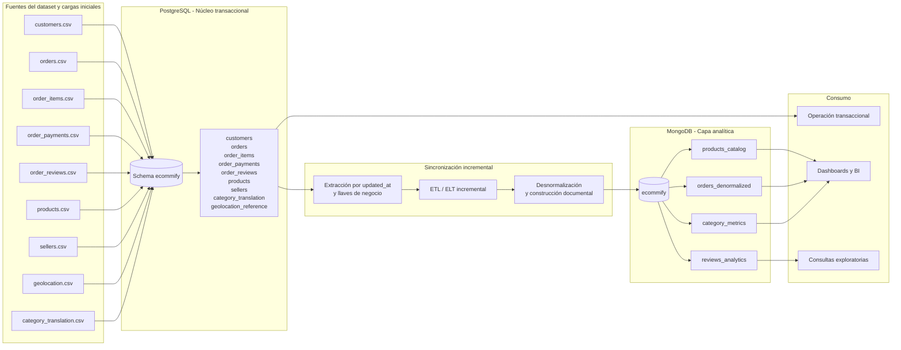

# Criterio Técnico de Arquitectura Híbrida - Ecommify

## 1. Objetivo

Este documento consolida el criterio técnico para distribuir los módulos y entidades de Ecommify entre PostgreSQL y MongoDB. La decisión se fundamenta en cuatro ejes:

- preferencia de Consistencia (C) o Disponibilidad (A) bajo el Teorema CAP
- nivel de estructuración de los datos
- patrón de acceso predominante: transaccional o analítico
- costo operativo de mantener sincronización entre motores

La arquitectura propuesta adopta un enfoque híbrido donde PostgreSQL actúa como fuente canónica operacional y MongoDB como capa de lectura desnormalizada para analítica y consultas de exploración rápida.

## 2. Criterio General de Decisión

### 2.1 Interpretación práctica de CAP

En un sistema distribuido, el Teorema CAP obliga a priorizar Consistencia o Disponibilidad cuando existe partición de red. Para este proyecto, la decisión no se toma por motor aislado sino por módulo funcional:

- Se prioriza **Consistencia (C)** cuando un error produce impacto financiero, pérdida de integridad referencial o ambigüedad operativa.
- Se prioriza **Disponibilidad (A)** cuando la tolerancia a consistencia eventual es aceptable y el valor principal está en mantener respuesta rápida para lectura o exploración analítica.

### 2.2 Regla arquitectónica base

- **PostgreSQL** recibe el núcleo operacional normalizado en 3FN.
- **MongoDB** recibe proyecciones documentales, agregados y vistas desnormalizadas orientadas a lectura.
- La sincronización es **asincrónica e incremental**, por lo que MongoDB no reemplaza al sistema de registro.

## 3. Análisis por Módulo

| Módulo | Entidades principales | Prioridad CAP | Datos | Patrón de acceso | Motor propuesto | Fundamentación técnica |
|---|---|---|---|---|---|---|
| Gestión de clientes | customers | C | Estructurados | Transaccional | PostgreSQL | Requiere integridad con órdenes, trazabilidad por cliente y joins confiables con historial de compra. |
| Gestión de órdenes | orders, order_items | C | Estructurados | Transaccional | PostgreSQL | Es el núcleo operacional; necesita atomicidad, consistencia temporal y control estricto de llaves foráneas. |
| Gestión de pagos | order_payments | C | Estructurados | Transaccional | PostgreSQL | El módulo financiero no tolera duplicados, pérdidas ni estados ambiguos. |
| Gestión de vendedores | sellers | C | Estructurados | Transaccional | PostgreSQL | Participa en relaciones operativas con order_items y requiere referencia estable. |
| Referencia geográfica | geolocation_reference | C | Estructurados | Mixto con sesgo transaccional | PostgreSQL | Funciona como dimensión maestra depurada para clientes y vendedores; conviene mantener una sola versión consistente. |
| Catálogo de productos operativo | products, category_translation | C | Estructurados | Mixto | PostgreSQL | Debe preservar consistencia con order_items y servir como maestro de producto. |
| Catálogo enriquecido de consulta | products_catalog | A | Semi-estructurados | Analítico | MongoDB | Conviene desnormalizar categoría, dimensiones y métricas para lecturas rápidas de catálogo y exploración. |
| Vista enriquecida de órdenes | orders_denormalized | A | Semi-estructurados | Analítico | MongoDB | Optimiza lectura de detalle completo de pedido sin joins costosos en consultas analíticas. |
| Analítica de reseñas | order_reviews, reviews_analytics | A | Semi-estructurados | Analítico | MongoDB | Las reseñas admiten desnormalización y agregación por score, categoría o producto con consistencia eventual. |
| Métricas por categoría | category_metrics | A | Semi-estructurados | Analítico | MongoDB | Es un agregado derivado, recalculable y orientado a dashboards; prima disponibilidad de lectura. |

## 4. Matriz de Decisión por Módulo y Entidad

| Módulo | Entidad o colección | Sistema de registro | CAP | Estructura | Acceso | Sincronización | Decisión |
|---|---|---|---|---|---|---|---|
| Clientes | customers | PostgreSQL | C | Estructurada | Transaccional | No aplica como réplica primaria | Permanece en PostgreSQL |
| Órdenes | orders | PostgreSQL | C | Estructurada | Transaccional | Se replica hacia MongoDB en proyección | Permanece en PostgreSQL |
| Ítems de orden | order_items | PostgreSQL | C | Estructurada | Transaccional | Se embebe en orders_denormalized | Permanece en PostgreSQL |
| Pagos | order_payments | PostgreSQL | C | Estructurada | Transaccional | Se resume o embebe en orders_denormalized | Permanece en PostgreSQL |
| Reseñas operativas | order_reviews | PostgreSQL | C | Estructurada | Mixto | Se proyecta a reviews_analytics y orders_denormalized | Permanece en PostgreSQL como fuente canónica |
| Vendedores | sellers | PostgreSQL | C | Estructurada | Transaccional | Puede replicarse como snapshot en documentos analíticos | Permanece en PostgreSQL |
| Geolocalización | geolocation_reference | PostgreSQL | C | Estructurada | Mixto | Puede alimentar agregados analíticos por región | Permanece en PostgreSQL |
| Producto maestro | products | PostgreSQL | C | Estructurada | Mixto | Alimenta catálogo enriquecido | Permanece en PostgreSQL como maestro |
| Traducción de categoría | category_translation | PostgreSQL | C | Estructurada | Mixto | Alimenta productos enriquecidos y métricas | Permanece en PostgreSQL |
| Catálogo enriquecido | products_catalog | MongoDB | A | Semi-estructurada | Analítico | Carga incremental desde PostgreSQL | Va a MongoDB |
| Orden analítica desnormalizada | orders_denormalized | MongoDB | A | Semi-estructurada | Analítico | Carga incremental desde PostgreSQL | Va a MongoDB |
| Analítica de reseñas | reviews_analytics | MongoDB | A | Semi-estructurada | Analítico | Carga incremental desde PostgreSQL | Va a MongoDB |
| KPI por categoría | category_metrics | MongoDB | A | Semi-estructurada | Analítico | Recalculada por lotes o micro-batch | Va a MongoDB |

## 5. Justificación Técnica: PostgreSQL vs MongoDB

### 5.1 Qué va a PostgreSQL

PostgreSQL debe concentrar el núcleo transaccional porque el dominio de Ecommify depende de:

- integridad referencial entre clientes, órdenes, ítems, pagos, productos y vendedores
- validación de reglas de negocio mediante PK, FK, CHECK e índices relacionales
- soporte ACID para eventos críticos de compra y pago
- trazabilidad operacional mediante columnas de auditoría creadas en el DDL final
- capacidad de reconstruir el historial exacto de una orden desde tablas maestras normalizadas

Las entidades que deben permanecer en PostgreSQL como verdad única son:

- customers
- orders
- order_items
- order_payments
- order_reviews
- sellers
- products
- category_translation
- geolocation_reference

### 5.2 Qué va a MongoDB

MongoDB debe recibir únicamente estructuras de lectura donde la desnormalización reduzca latencia y simplifique consultas:

- **products_catalog** para exponer producto, categoría traducida, dimensiones y métricas derivadas en un solo documento
- **orders_denormalized** para consultar una orden con snapshot de cliente, ítems, pagos, reseñas y totales sin múltiples joins
- **reviews_analytics** para análisis por sentimiento, score, categoría o contexto comercial
- **category_metrics** para dashboards y KPIs agregados por categoría

Estas colecciones son adecuadas para MongoDB porque:

- su costo de recomputación es aceptable
- toleran consistencia eventual
- están orientadas a lectura y agregación
- combinan atributos de varias tablas en un mismo documento
- reducen el costo de consultas analíticas frecuentes

## 6. Arquitectura Híbrida Propuesta

## 7. Estrategia de Sincronización

### 7.1 Principio rector

La sincronización aplica solo desde PostgreSQL hacia MongoDB. No existe escritura operativa en doble vía. PostgreSQL es la fuente canónica y MongoDB actúa como proyección analítica.

### 7.2 Mecanismo recomendado

Se recomienda una sincronización incremental basada en:

- columnas **created_at** y **updated_at** mantenidas por triggers en PostgreSQL
- extracción por ventanas de tiempo o high-water mark
- reconstrucción idempotente del documento destino por clave de negocio
- cargas por lotes pequeños o micro-batches según capacidad de la plataforma

### 7.3 Flujo operativo de sincronización

1. Identificar en PostgreSQL los registros insertados o actualizados desde la última ejecución.
2. Extraer las tablas base afectadas: orders, order_items, order_payments, order_reviews, products, customers, sellers y category_translation.
3. Resolver joins y snapshots requeridos para construir documentos analíticos.
4. Aplicar upsert en MongoDB sobre product_id, order_id, review_id o product_category_name según la colección.
5. Registrar métricas de control: filas extraídas, documentos insertados, documentos actualizados y errores.

### 7.4 Estrategia por colección

| Colección MongoDB | Fuente PostgreSQL | Clave de sincronización | Estrategia |
|---|---|---|---|
| products_catalog | products + category_translation + métricas derivadas | product_id | Upsert por producto; recalcular métricas agregadas si cambia categoría o atributos físicos |
| orders_denormalized | orders + customers + order_items + order_payments + order_reviews | order_id | Reconstrucción completa del documento por orden afectada |
| reviews_analytics | order_reviews + orders + order_items + products | review_id | Upsert por reseña y enriquecimiento contextual |
| category_metrics | products + order_items + order_reviews + order_payments | product_category_name | Reagregación periódica por lote o recalculo incremental |

### 7.5 Riesgos y mitigaciones

| Riesgo | Impacto | Mitigación |
|---|---|---|
| Desfase entre PostgreSQL y MongoDB | Lecturas analíticas desactualizadas | Definir SLA de sincronización menor a 5 minutos |
| Duplicidad por reproceso | Métricas incorrectas o documentos repetidos | Usar upsert idempotente y claves únicas en MongoDB |
| Cambios parciales de una orden | Documento inconsistente en la proyección | Reconstruir el documento completo por order_id afectado |
| Saturación en Atlas M0 | Degradación del rendimiento | Micro-batches, compactación documental y pruning de campos no esenciales |
| Crecimiento de documentos | Riesgo de acercarse al límite de 16 MB | Embebido controlado y monitoreo del tamaño de orders_denormalized |

## 8. Conclusión Ejecutiva

La decisión arquitectónica correcta para Ecommify es separar responsabilidad operacional de responsabilidad analítica:

- **PostgreSQL** conserva los módulos de clientes, órdenes, pagos, vendedores, productos maestros y georreferencia por su necesidad de consistencia fuerte.
- **MongoDB** recibe catálogos enriquecidos, órdenes desnormalizadas, analítica de reseñas y métricas por categoría por su afinidad con lectura intensiva y consistencia eventual.
- El criterio CAP por módulo queda definido como **C para el núcleo operacional** y **A para las proyecciones analíticas**.

Este enfoque minimiza riesgo transaccional, mantiene una única fuente de verdad y habilita consultas analíticas de baja latencia sin degradar el modelo relacional base.